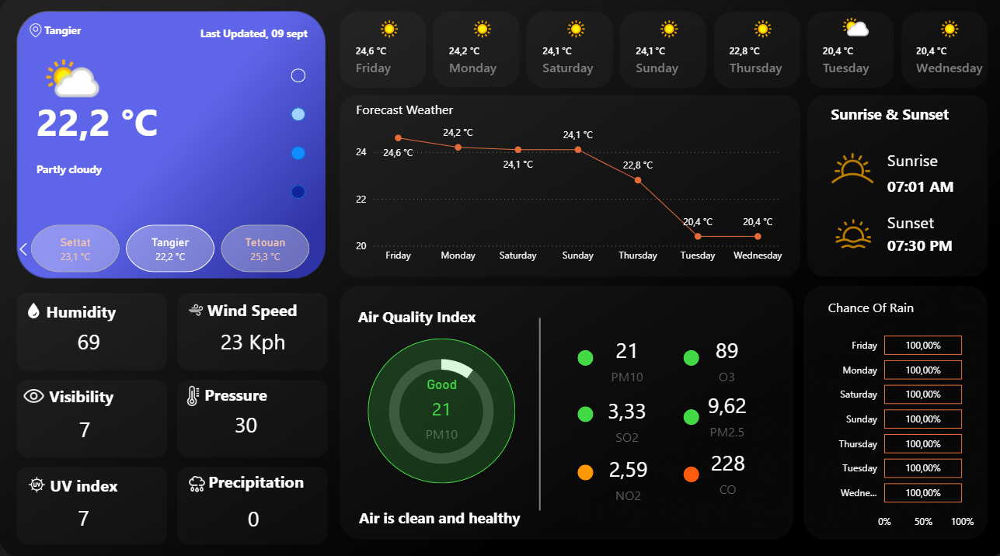
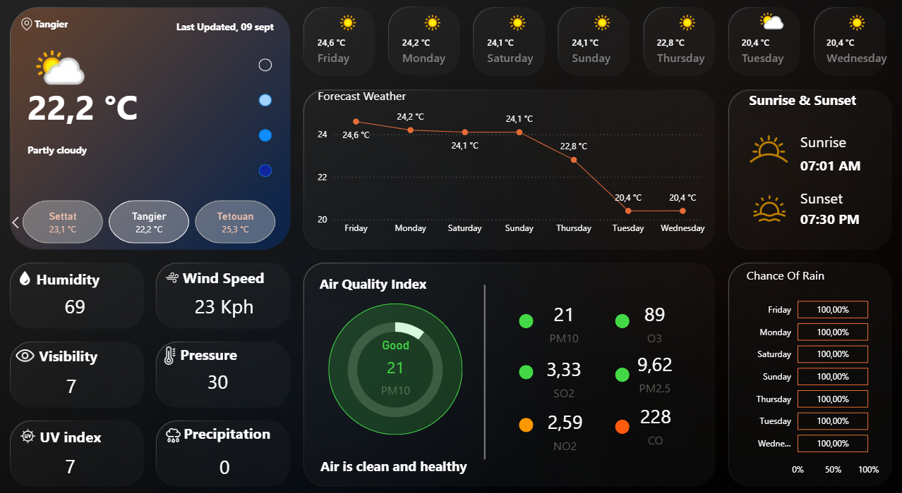
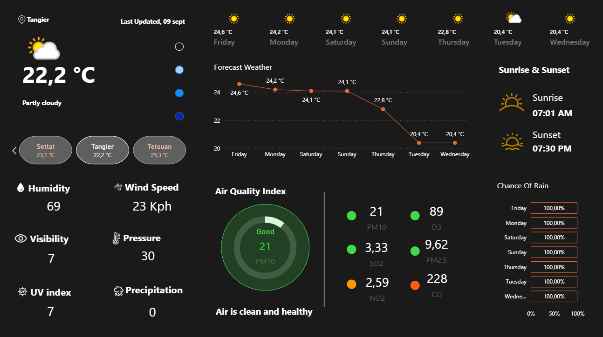

# Power BI Weather Analysis for Morocco

This project is a comprehensive analysis of weather patterns across Morocco using Microsoft Power BI. The goal was to clean, model, and visualize data from the WeatherAPI.com public API to identify key trends and insights.

---

##  dashboards
Below are snapshots of the interactive dashboard.

---

## 🚀 The Project
This dashboard answers key questions about Morocco's climate:
* What are the average monthly temperature and precipitation trends across the country?
* How do weather patterns differ between major cities (e.g., coastal Rabat vs. inland Marrakech)?
* What is the correlation between humidity, wind speed, and temperature?
* Which months experience the highest average UV index or most rainfall?

## 🛠️ Tools & Data
* **Tool:** Microsoft Power BI
* **Data Source:** [WeatherAPI.com](https://www.weatherapi.com/) (live public API)
* **Data Cleaning:** Performed in **Power Query** to handle the JSON API responses, manage missing values, and format data types (e.g., text to date/time).
* **Data Modeling:** Created a star schema with a central fact table (weather readings) and dimension tables (date, location).
* **Visualization:** Used **DAX (Data Analysis Expressions)** measures to create complex, time-intelligent calculations (like Year-over-Year changes) and key performance indicators (KPIs).

## 📚 What I Learned
* Full-cycle BI project development: from connecting to a live API to building a final, interactive dashboard.
* Advanced data cleaning and transformation in Power Query (specifically handling JSON data).
* Writing complex DAX measures to create meaningful, time-based KPIs.
* Data storytelling: how to arrange visuals to present a clear and actionable analysis for a user.
